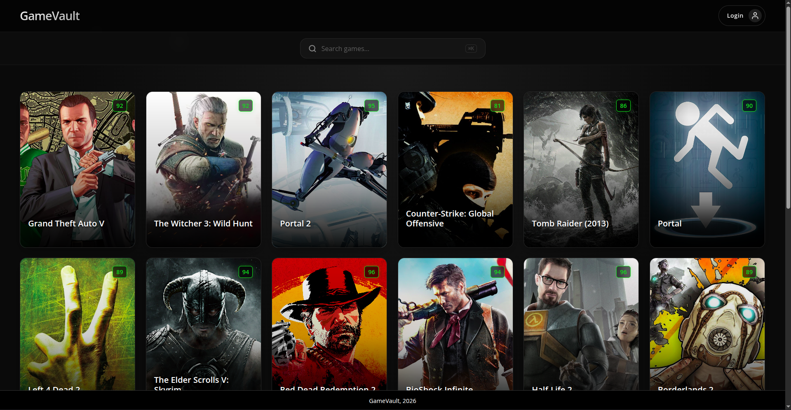
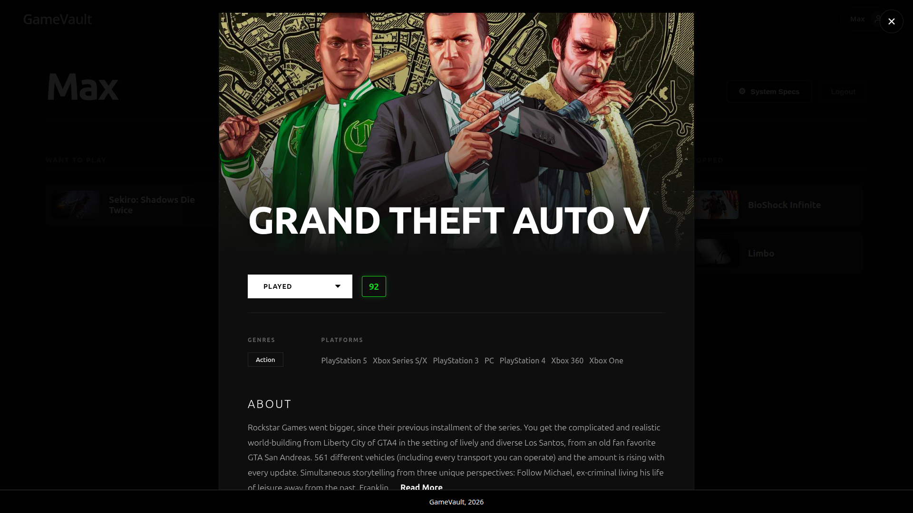
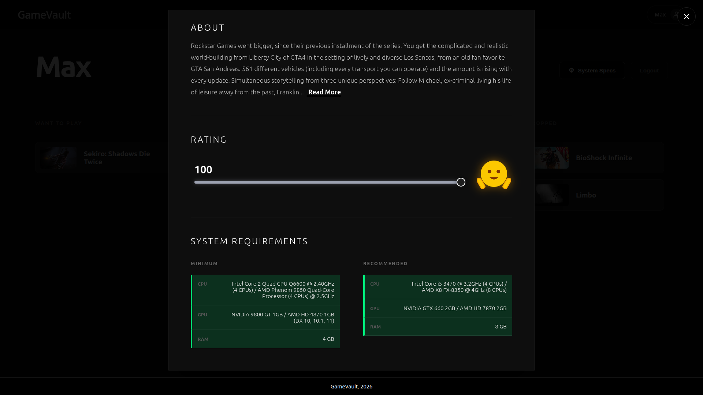
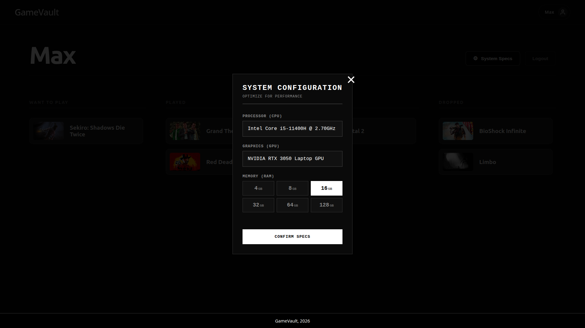
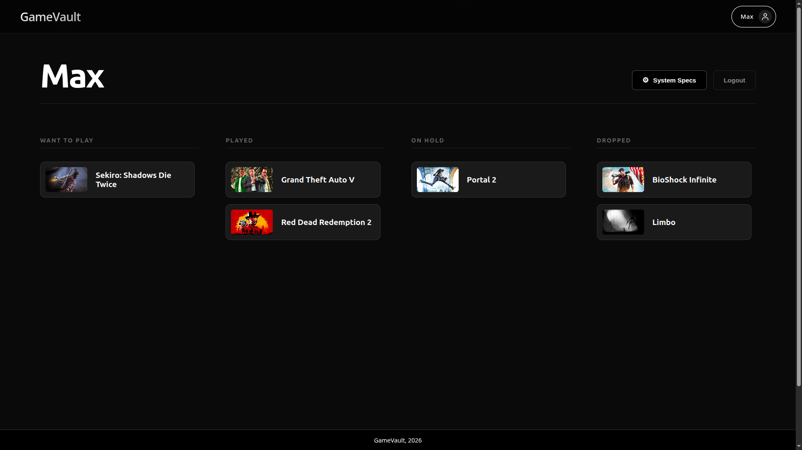
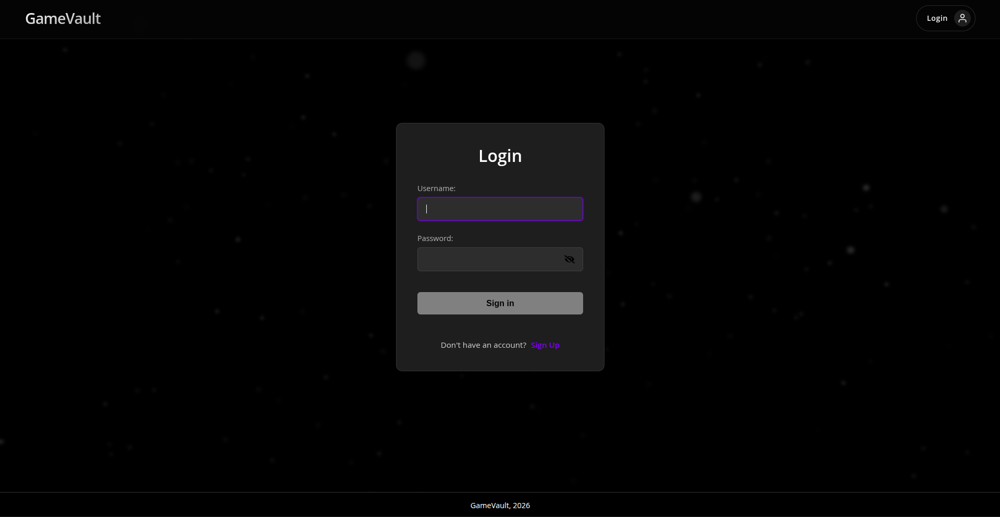

# GameVault 🎮

GameVault is a full-stack web application designed for gamers to discover, track, and manage their video game collections. Built with the MERN stack and powered by the RAWG API, it provides a comprehensive database of games, personalized library management, and a unique system requirement comparison tool. 

## 🌐 Live Demo
* **Frontend:** https://game-vault-cyan.vercel.app/

## 📸 Screenshots

### Home Page


### Game Details



### System Configuration Comparison


### User Profile & Library


### Authentication


## ✨ Features

### Core Functionality
* **Vast Game Discovery:** Browse a massive collection of games fetched via the RAWG API, complete with descriptions, genres, platforms, and metacritic ratings.
* **Library Management:** Categorize your personal gaming journey into four distinct lists: *Played*, *Want to Play*, *On Hold*, and *Dropped*.
* **Personalized Ratings:** Rate games on a granular scale of 0-100 to keep track of your true favorites.
* **System Spec Comparison (Beta):** Save your PC specifications and instantly compare them against a game's minimum and recommended system requirements.
* **Account Settings:** Change your password or permanently delete your account (with password confirmation) from the profile page.

### Technical & UI Features
* **Stylized Aesthetics:** Clean, minimalist design with a high-contrast art style inspired by modern RPGs, featuring smooth animations powered by Framer Motion.
* **Optimized Performance:** Implements infinite scrolling and React Query for seamless data caching and fetching.
* **Smart Search:** Fast, responsive search functionality utilizing debouncing on the client and fuzzy matching on the server.
* **Secure Authentication:** User registration and login protected by bcrypt password hashing, short-lived JWT access tokens, and httpOnly refresh cookies.
* **Accessible by Design:** All interactive elements (cards, modals, nav) are keyboard-operable, modals trap focus and close on `Esc`, and errors surface as visible toast notifications instead of failing silently.

## 🔒 Security

* Rate limiting on authentication endpoints to slow down brute-force/credential-stuffing attempts.
* Request sanitization against NoSQL injection, with server-side validation on all auth and rating inputs.
* `helmet`-based security headers (HSTS, no-sniff, frame-deny, etc.) on every response.
* Generic authentication error messages to avoid leaking whether a username exists.
* Dependencies are kept patched — `npm audit` is run regularly against both `Client` and `Server`.

## 🛠️ Tech Stack

**Frontend (Deployed on Vercel):**
* React 19 (via Vite)
* React Router DOM 
* TanStack React Query 
* Framer Motion 
* RC-Slider 

**Backend (Deployed on Render):**
* Node.js & Express.js
* MongoDB & Mongoose
* JSON Web Tokens (JWT) & Cookie Parser 
* Bcrypt 
* Helmet & express-rate-limit
* Fast-Fuzzy 
* Axios 

## 🚀 Getting Started Locally

### Prerequisites
* Node.js installed on your machine
* A MongoDB database (local or Atlas)
* A free API key from [RAWG](https://rawg.io/apidocs)

### 1. Clone the repository
```bash
git clone https://github.com/MAX5271/GameVault.git
cd GameVault

```

### 2. Setup the Backend

```bash
cd Server
npm install

```

Create a `.env` file in the `Server` directory:

```env
PORT=3000
DATABASE_URI=<your_mongodb_uri_here>
ACCESS_TOKEN_SECRET=<your_access_token_secret_here>
REFRESH_TOKEN_SECRET=<your_refresh_token_secret_here>
RAWG_API_KEY=<your_rawg_api_key_here>

```

All five variables are required — the server checks for them on startup and exits with an error if any are missing.

Start the backend server:

```bash
npm start

```

### 3. Setup the Frontend

```bash
cd ../Client
npm install

```

Create a `.env` file in the `Client` directory. For local development, point it to your local backend:

```env
VITE_API_URL="http://localhost:3000"

```

Start the frontend development server:

```bash
npm run dev

```

## ☁️ Deployment Notes

This project is configured for split deployment:

* **Frontend (Vercel):** Ensure your build command is set to `npm run build` and the output directory is `dist`. Add `VITE_API_URL` to your Vercel environment variables, pointing to your live Render backend URL.
* **Backend (Render):** Set up as a Web Service. Ensure the Build Command is `npm install` and the Start Command is `npm start` (runs `node index.js`). Add all backend `.env` variables to the Render dashboard. Make sure to configure CORS in your Express app to accept requests from your specific Vercel domain.

## 🗺️ Future Implementations

* **OAuth Integration:** Simplified user login.
* **Advanced Filtering:** Genre-based filtering across libraries and searches.
* **Recommendation Engine:** Personalized game suggestions based on user rating history.

